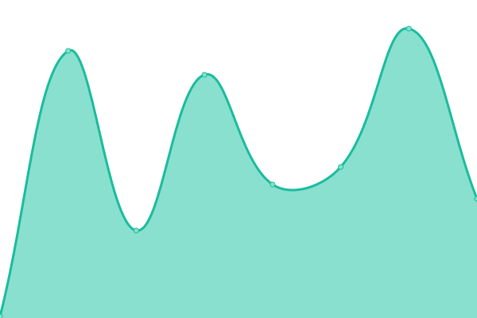

# [📈 Live Status](https://status.fluxbound.es): <!--live status--> **Todos los sistemas están operativos**

This repository contains the open-source uptime monitor and status page for [Upptime](https://upptime.js.org), powered by [Upptime](https://github.com/upptime/upptime).

With [Upptime](https://upptime.js.org), you can get your own unlimited and free uptime monitor and status page, powered entirely by a GitHub repository. We use [Issues](https://github.com/upptime/upptime/issues) as incident reports, [Actions](https://github.com/Fluxbound/fluxbound-status-page/actions) as uptime monitors, and [Pages](https://status.fluxbound.es) for the status page.

<!--start: status pages-->
<!-- This summary is generated by Upptime (https://github.com/upptime/upptime) -->
<!-- Do not edit this manually, your changes will be overwritten -->
<!-- prettier-ignore -->
| URL | Status | History | Response Time | Uptime |
| --- | ------ | ------- | ------------- | ------ |
|  [Landing](https://fluxbound.es) | Correcto | [landing.yml](https://github.com/Fluxbound/fluxbound-status-page/commits/HEAD/history/landing.yml) | 

 135ms
     
 | 

<a href="https://status.fluxbound.es/history/landing">100.00%</a>
    

|  [Web](https://app.fluxbound.es) | Correcto | [web.yml](https://github.com/Fluxbound/fluxbound-status-page/commits/HEAD/history/web.yml) | 

 1175ms
     
 | 

<a href="https://status.fluxbound.es/history/web">100.00%</a>
    

|  [API](https://api.fluxbound.es) | Correcto | [api.yml](https://github.com/Fluxbound/fluxbound-status-page/commits/HEAD/history/api.yml) | 

 468ms
     
 | 

<a href="https://status.fluxbound.es/history/api">100.00%</a>
    

|  VPN | Correcto | [vpn.yml](https://github.com/Fluxbound/fluxbound-status-page/commits/HEAD/history/vpn.yml) | 

 112ms
     
 | 

<a href="https://status.fluxbound.es/history/vpn">100.00%</a>
    

<!--end: status pages-->

[**Visit our status website →**](https://status.fluxbound.es)

## 📄 License

- Powered by: [Upptime](https://github.com/upptime/upptime)
- Code: [MIT](./LICENSE) © [Anand Chowdhary](https://anandchowdhary.com), supported by [Pabio](https://pabio.com)
- Data in the `./history` directory: [Open Database License](https://opendatacommons.org/licenses/odbl/1-0/)
